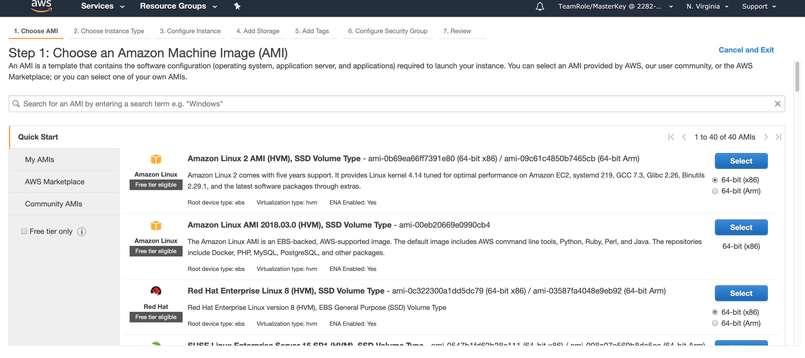
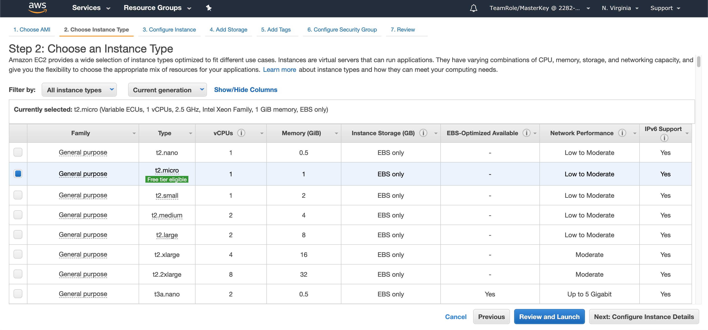
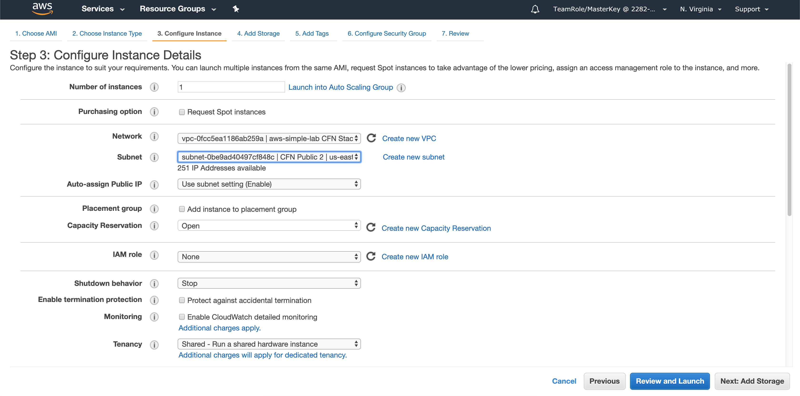
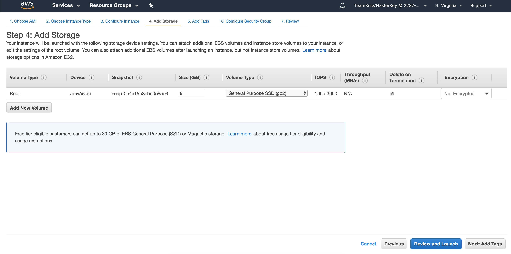
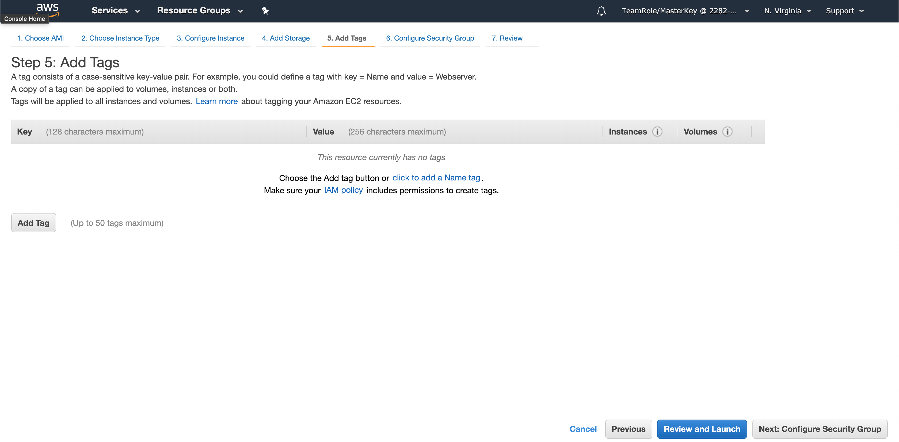
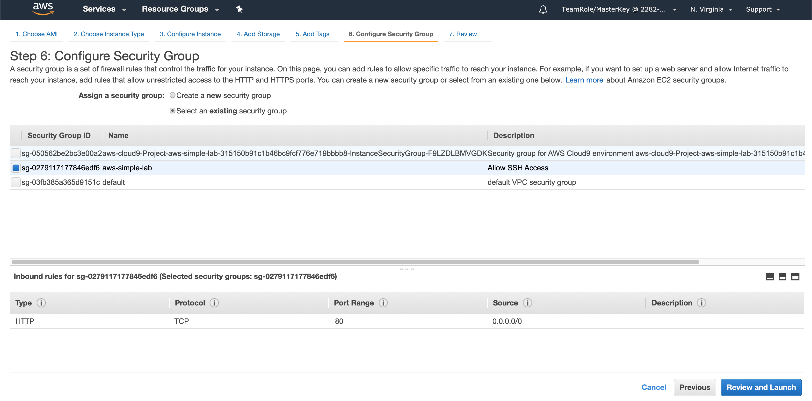
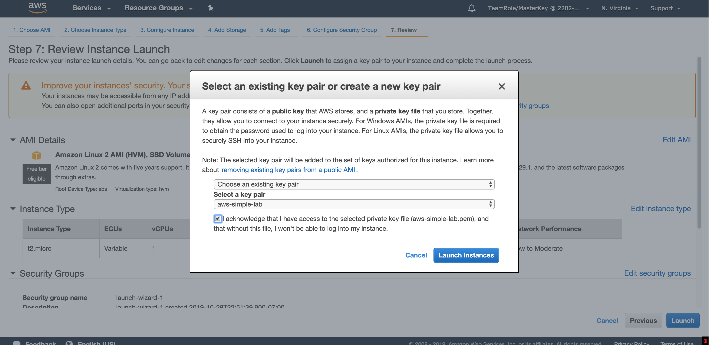
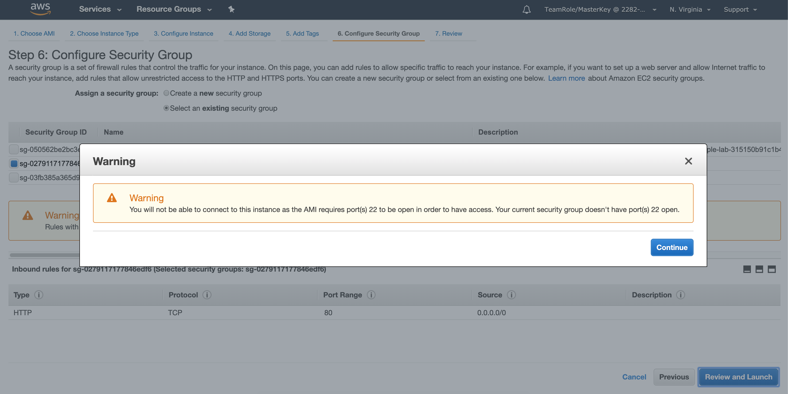

## Launch your first EC2 Instance

The goal of this section is to get you familiar with EC2 and VPC. Then we can build on it to access S3.

### Lab 1 - Launch and connect to an EC2 instance
The first thing we'll do is try to launch an EC2 instance into one of the public subnets of the VPC

1\. Create an EC2 Key Pair

In order to log into your instance later, you'll have to create a key pair. You can do this in the console by navigating to the Key Pairs page of the EC2 Console or you can run a CLI command:

<pre>
$ aws ec2 create-key-pair --key-name aws-simple-lab --query 'KeyMaterial' --output text > aws-simple-lab.pem
$ chmod 600 aws-simple-lab.pem
</pre>

This command creates a key pair and outputs it as a text file named `aws-simple-lab.pem`. The chmod command locks it down. Keep in mind that you will never be able to download this key pair again, so don't lose it.

2\. Launch an EC2 instance into a PUBLIC subnet

Navigate to the [AWS EC2 Console](https://console.aws.amazon.com/ec2) and click **Launch Instance**. Launch an instance with the following properties:

- AMI: ami-0b69ea66ff7391e80 (**"Amazon Linux 2 AMI (HVM), SSD Volume Type"**)

- Instance type: t2.micro

- In the VPC that was created for you in a PUBLIC subnet (It's tagged public)
- Auto assigns a public IP

- Leave storage as default

- Leave tags as default

- Attach the aws-simple-lab security group

- With your aws-simple-lab keypair

- Forget about this for now

- Choose the keypair you created previously and Launch!

3\. Try to connect to your EC2 instance.

From Cloud9, try to connect. Get the public IP of your instance and use this command:

<pre>
$ nc -v publicIPofInstance 22
</pre>

4\. Troubleshoot your connectivity

For some reason it doesn't seem like you can access your EC2 instance. Try and figure out why. 

HINT 1

There are a number of prerequisites for EC2 instances to be reachable via public IP. First they must have a public IP. Make sure you set the instance up properly with a publicly routable IP. 

Check the instance properties on the bottom of the instances page

HINT 2

The next thing to look at is the security group of your instance. Is it allowing access to port 22 from anything?
- How do you add access to everyone? Can we lock it down at all? http://http://checkip.amazonaws.com/
- If you lock it down to the IP above, will Cloud9 still be able to hit it?

HINT 3

Finally, let's consider the VPC design. It's possible that the VPC was designed incorrectly. 
- What's required to allow inbound internet connectivity? 

HINT 4

Check the subnet your instance is in and look at the route tables. What's required for internet connectivity here? Since we're focusing on the public subnet, the answer is here: [VPC Scenario 1](https://docs.aws.amazon.com/vpc/latest/userguide/VPC_Scenario1.html).

FINAL HINT

Does the route table show a route to an IGW for 0.0.0.0/0? It doesn't. Choose a different route table to associate with the subnet. One of them will have the 0.0.0.0/0 route.

5\. Test connectivity again

From Cloud9, do this again:

<pre>
$ nc -v publicIPofInstance 22
Connection to ec2-52-212-4-85.us-east-1.compute.amazonaws.com 22 port [tcp/ssh] succeeded!
</pre>

6\. Log into your EC2 instance
If you have Putty or an ssh client, feel free to use that. Otherwise, log into Cloud9, copy in your pem and log into your new instance like this:

<pre>
TeamRole:~/environment $ ssh -i simple.pem ec2-user@ec2-3-88-148-113.compute-1.amazonaws.com                                                                                                  
The authenticity of host 'ec2-3-88-148-113.compute-1.amazonaws.com (10.0.1.151)' can't be established.
ECDSA key fingerprint is SHA256:18TttSwSLO6eDip8UiAo8kFlcy3ZOjl2pjO44aCd8mI.
ECDSA key fingerprint is MD5:38:fb:f9:b0:7e:10:de:e1:88:0d:62:47:fe:01:cc:de.
Are you sure you want to continue connecting (yes/no)? yes
Warning: Permanently added 'ec2-3-88-148-113.compute-1.amazonaws.com,10.0.1.151' (ECDSA) to the list of known hosts.
...
</pre>

### Checkpoint

At this point, you should be able to hit your instance and log in. But now we have to make sure the VPC is actually deployed correctly. 