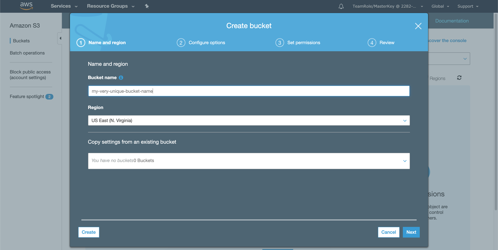
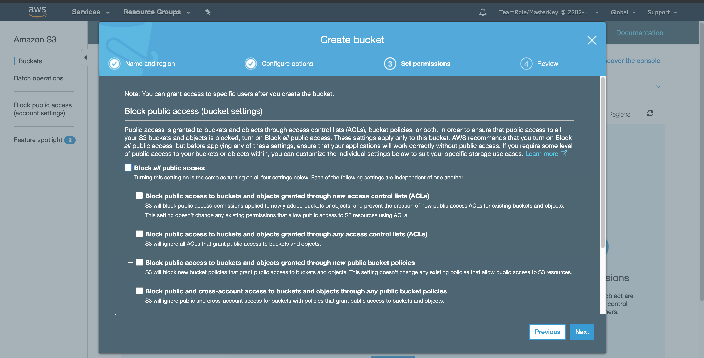
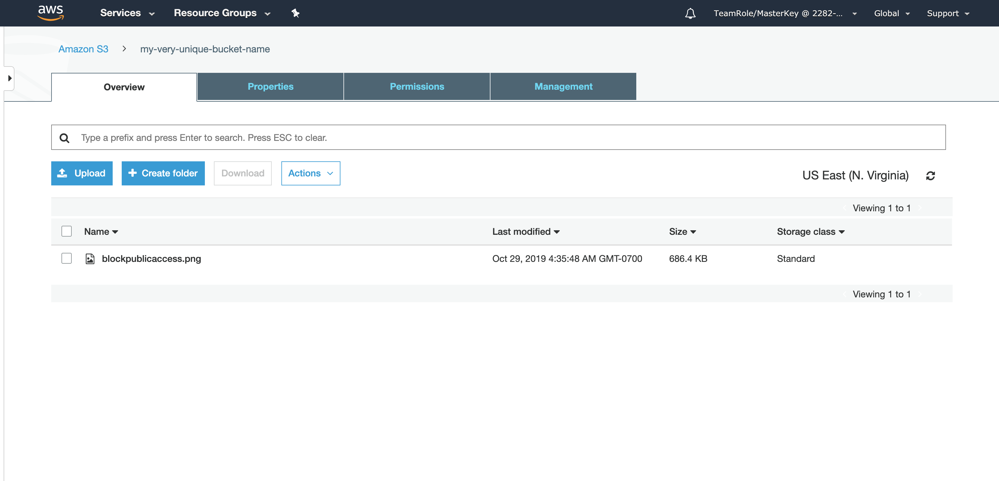
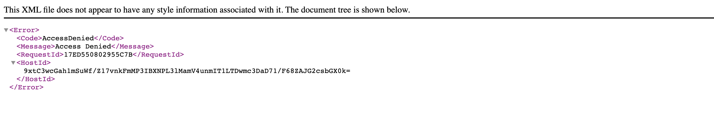
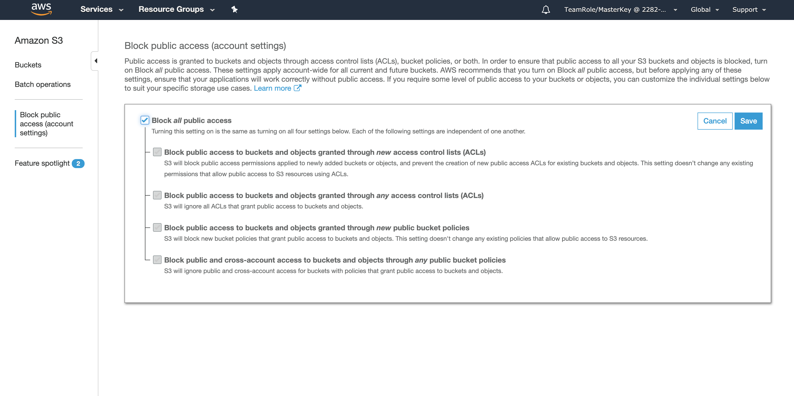

## Create and Use your first S3 Bucket

The goal of this section is to show you how to use S3

### Lab 1 - Create an S3 Bucket
In order to use S3, we'll have to create an S3 bucket. In the previous sections, we mentioned that the use of Cloud9 was optional. If you chose to use your own machines, you'll have to install the AWS CLI. Otherwise, use the pre-installed version in Cloud9.

1\. Create the S3 bucket

Navigate to the [AWS S3 Console](https://console.aws.amazon.com/s3). Click on **Create Bucket**. Think of a unique name for your S3 bucket. Remember, S3 bucket namespaces are global, so your bucket name has to be unique. Keep hitting **Next** until you get to a page with **Block All Public Access**. Uncheck it. We will work on that part later. 

Uncheck **Block All Public Access**

You have created an S3 bucket! Let's add something to it now.

2\. Upload an Object

Click the bucket you just created. Upload an object using default settings.

3\. Make the object public

In order to allow the public to access the object, you have to make it public. Keep in mind that this is usually how high profile news stories happen. People get lazy and leave their objects public. Let's pretend that these objects are meant to be public. We will also lock it down later.

Click on the object you created in step 2. At the bottom of the properties, you should see a link that's something like this:

<pre>
Object URL
https://my-very-unique-bucket-name.s3.amazonaws.com/blockpublicaccess.png
</pre>

Click it and see what it gives you. You should get an **Access Denied**. By default, objects are **PRIVATE** unless otherwise specified.

Now click the **Make Public** button.

Try the link again. You should be able to access your object now. If not, you may have skipped the step to **uncheck** Block all public access. Check the permissions of your bucket.

4\. Secure the Bucket

Let's now assume that we don't want objects public in this entire account. S3 has a setting to deal with that across the board.

In the S3 console, click **Block public access (account settings)**. Click **Edit** and tick off **Block all public access**.

Now try your object again. It should be blocked now.

## Checkpoint

Congratulations! You've created an EC2 instance and an S3 object. If you still have some time, try to access the S3 object from EC2. You can use the pre-installed AWS CLI on Cloud9 to do it. 

<pre>
$ aws s3 cp s3://bucketname/objectname .
</pre>

