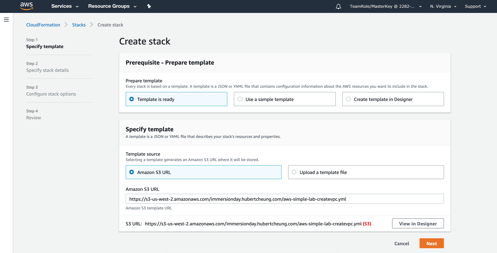
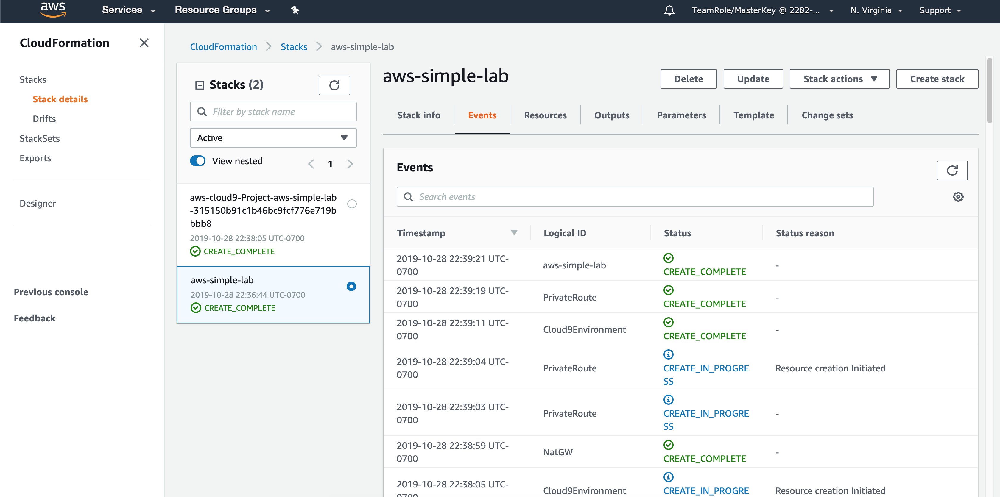

# CloudFormation Workshop
## Build your first web app with CloudFormation

## Summary
The goal of this workshop is to give users a hands on experience building CloudFormation templates. Ultimately, when all is done, users will have a working website on AWS. 

### Workshop Setup

Workshop accounts have already been created for you. Simply log into them and start the labs. You can feel free to run commands from anywhere, but a Cloud9 instance will be created for your convenience.

Use the accounts previously provided to you. Sign in at https://acctnum.signin.aws.amazon.com/.

Click on the **Deploy to AWS** icon below to region to stand up the core workshop infrastructure.

Region | Launch Template
------------ | -------------  
**N. Virginia** (us-east-1) |   
<!-- **Ireland** (eu-west-1) |   
**Oregon** (us-west-2) |   -->

Once you click the button above, you should be taken to the AWS CloudFormation console. Keep clicking **Next** until your stack starts creating.

Click **Next**

Leave the name as **aws-simple-lab**, click **Next**

Keep clicking **Next** until you get to **Create Stack**, then click **Create Stack**. Eventually, you'll see 2 stacks and a **CREATE_COMPLETE**:

Once you see that everything is in a **CREATE_COMPLETE** state, move on to the next step

### Familiarize yourself with the workshop environment

1\. Access your AWS Cloud9 Development Environment

In the AWS Management Console, go to the [Cloud9 Dashboard](https://console.aws.amazon.com/cloud9/home) and find your environment which should be prefixed with the name of the CloudFormation stack you created earlier. You can also find the name of your environment in the CloudFormation outputs as Cloud9Env. Click **Open IDE**.

2\. Familiarize yourself with the Cloud9 Environment

On the left pane (Blue), any files downloaded to your environment will appear here in the file tree. In the middle (Red) pane, any documents you open will show up here. Test this out by double clicking on README.md in the left pane and edit the file by adding some arbitrary text. Then save it by clicking **File** and **Save**. Keyboard shortcuts will work as well.

On the bottom, you will see a bash shell (Yellow). For the remainder of the lab, use this shell to enter all commands.  You can also customize your Cloud9 environment by changing themes, moving panes around, etc. As an example, you can change the theme from light to dark by following the instructions [here](https://docs.aws.amazon.com/cloud9/latest/user-guide/settings-theme.html).

### Set Up Cloud9 Environment (Optional if you want to use CLI but don't have it set up locally)

1\. Clone Workshop Repo

There are a number of files and startup scripts we have pre-created for you. They're all in the main repo that you're using, so we'll clone that locally. Run this:

<pre>
$ git clone https://github.com/hub714/aws-simple-lab.git
</pre>

2\. Configure the AWS Command Line Interface (CLI)

As we'll be using the AWS CLI for this lab, let's configure it first. Cloud9 will automatically configure credentials for you, so what we're looking to do is verify the region.

<pre>
TeamRole:~/environment $ aws configure list
      Name                    Value             Type    Location
      ----                    -----             ----    --------
   profile                <not set>             None    None
access_key     ****************O5ON shared-credentials-file    
secret_key     ****************ND+k shared-credentials-file    
    region                us-east-1      config-file    ~/.aws/config
</pre>

You should see a region value of **us-east-1**. If this is not the case, ask your instructor to take a look.

Now test the CLI:

<pre>
$ aws ec2 describe-instances
</pre>

You should see something like this:

<pre>
TeamRole:~/environment $ aws ec2 describe-instances
{
    "Reservations": [
        {
            "Instances": [
                {
                    
...
                }
            ]
        }
    ]   
}
</pre>

If not, raise your hand.

### Let's begin!

Now you're ready to begin! [Click here](0-launch-ec2) to continue on.